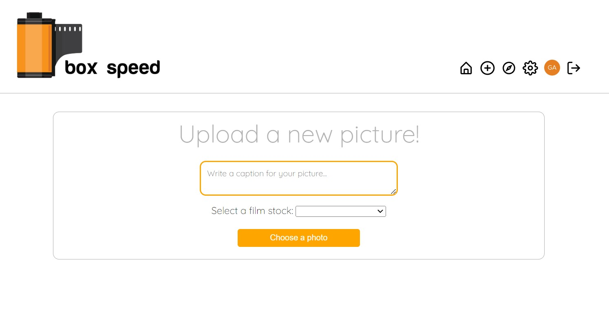
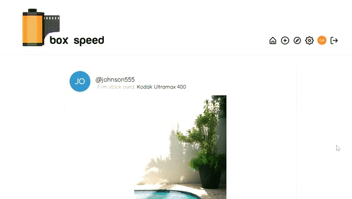
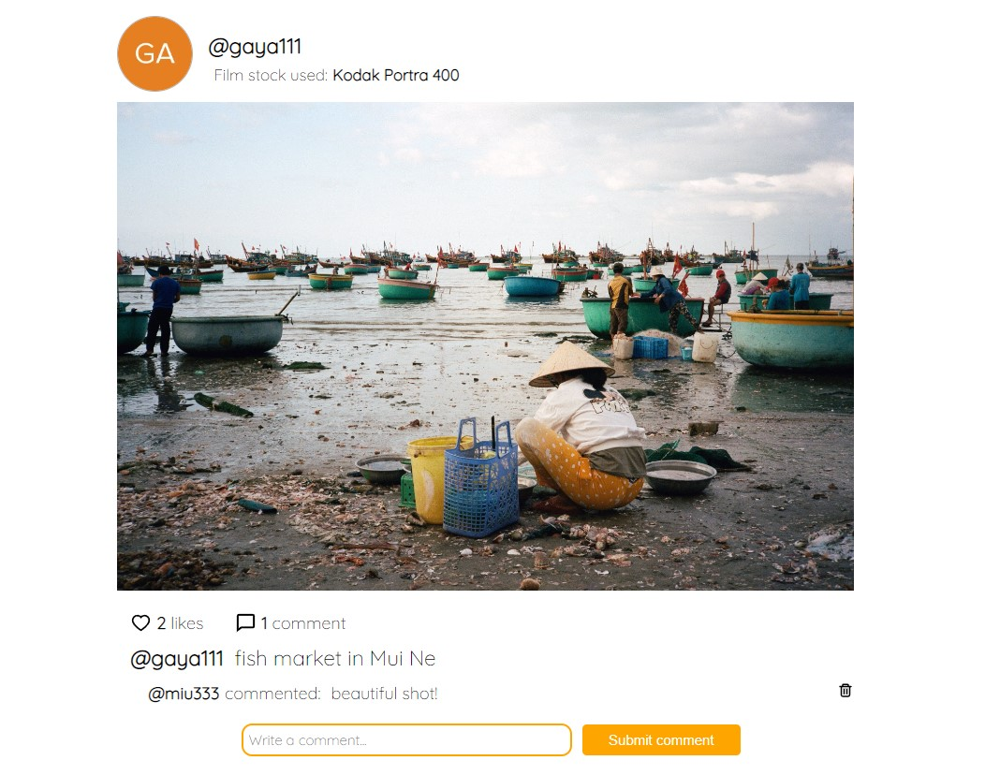
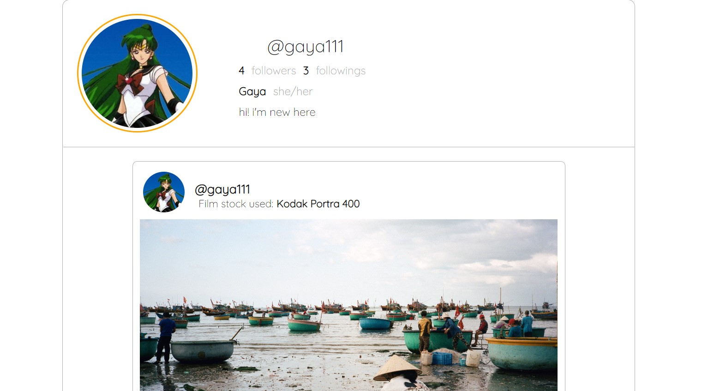
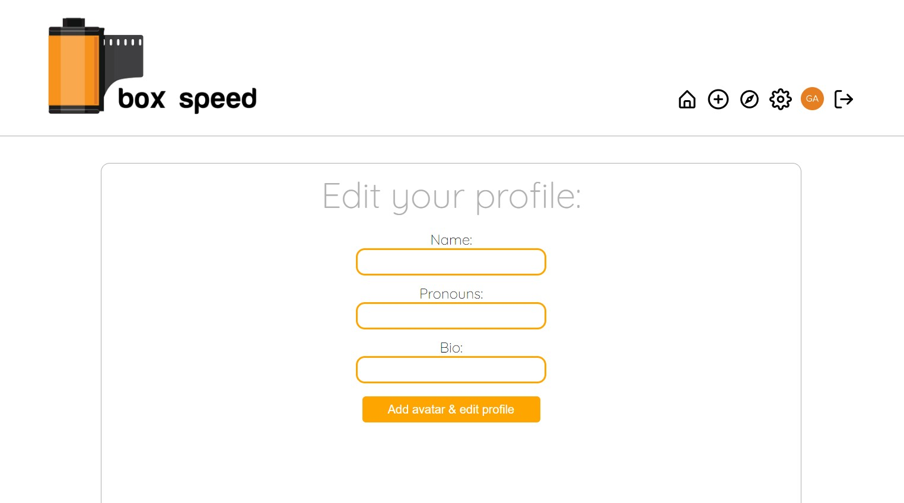

# final-project
Box Speed is an app for people who love film photography and want to share their pictures and connect with others. 
Users can create an account, update their profile, upload pictures, like & comment on other's people pictures and follow other users. Not logged in users can only browse pictures but can not like, comment, follow or see profiles.

For a quick demo, follow this link:
https://www.youtube.com/watch?v=TecfDRO-fuI

## Upload new pictures
Users will be able to upload pictures from their computer, add a caption and select which film stock they used.

## Feed
Users will have a feed where they can see pictures from users they follow.

## Details
When users click on a picture, they will see a detailed version of the picture. They will see how many comments and likes the picture has, they will be able to leave a comment and like. They will also be able to see who published that picture.

## Profile
Users will have a profile where they can show their stats, bio and name. All pictures posted by that specific user will be shown there.

## Edit profile
Users can edit their profile

